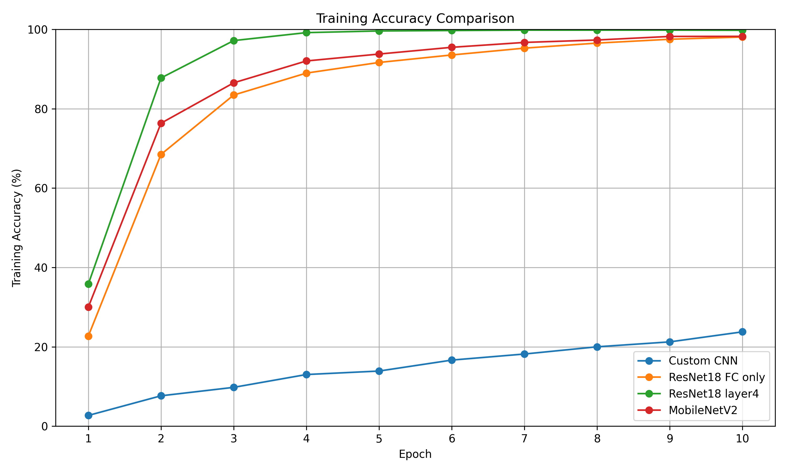
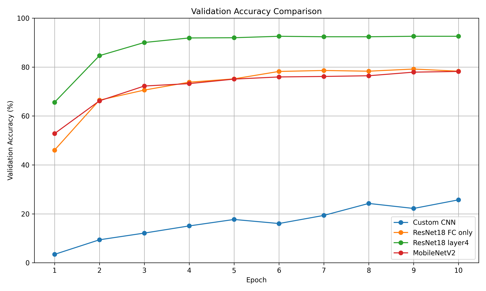
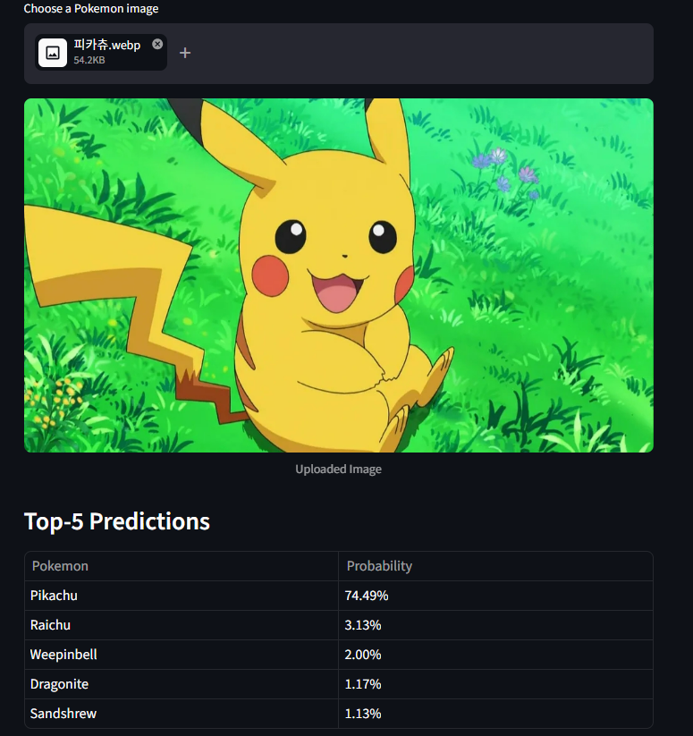
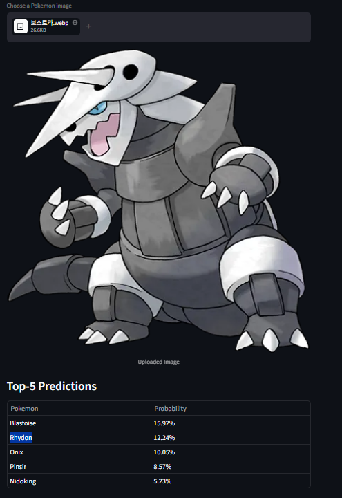

# WhosThatPokemon
### Pokemon Image Classifier

## 프로젝트 개요
본 프로젝트는 포켓몬 이미지 분류기를 구현하고, Transfer Learning의 효과를 분석하기 위해 여러 모델을 비교하는 것을 목표로 두었습니다.

총 4가지 실험을 통해 모델의 성능을 비교하였습니다.

---

## 사용 모델

- Custom CNN (baseline)
- ResNet18 (FC layer만 학습)
- ResNet18 (layer4 fine-tuning)
- MobileNetV2 (FC layer만 학습)

---

## 성능 비교

| 모델 | Validation Accuracy |
|------|--------------------|
| Custom CNN | 25.71% |
| ResNet18 (FC only) | 79.18% |
| ResNet18 (fine-tuning) | 92.57% |
| MobileNetV2 | 78.20% |

---

## 결과 분석

- Custom CNN은 pretrained 모델 없이 학습하여 낮은 성능을 보임
- ResNet18 pretrained 모델은 마지막 FC layer만 학습했음에도 높은 성능을 달성.
- layer4까지 fine-tuning을 수행한 경우 성능이 크게 향상되었으며, 이는 pretrained feature를 데이터셋에 맞게 조정하는 것이 중요함.
- MobileNetV2는 경량 모델임에도 ResNet18과 유사한 성능을 보여 효율적인 모델임을 확인.

---

## Learning Curve

### Validation Accuracy 비교
- 트레이닝 에러 비교

- test 결과 예측 (validateion error)

---

## 예제 결과

- 데이터 Class 내 있는 경우

- 데이터 클래스 내 없는 경우

---
